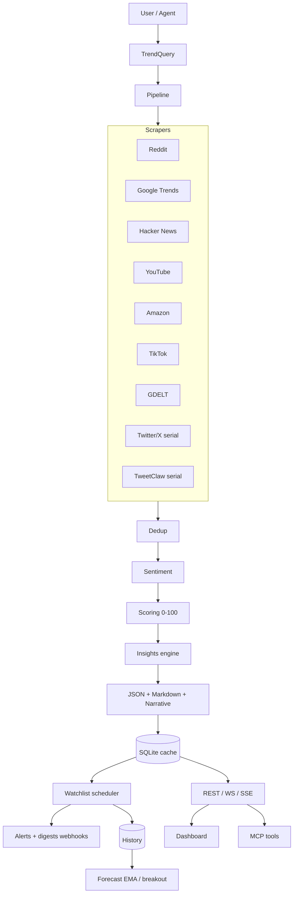

# TrendScope

<p align="center">
  <strong>Universal trend intelligence — nine free sources, one pipeline.</strong><br>
  Sentiment · Insights · Watchlist alerts · Forecasting · Async jobs · Live dashboard
</p>

<p align="center">
  <a href="https://github.com/mamboyepez17/trendscope/actions"></a>
  <a href="https://www.python.org/downloads/"></a>
  <a href="LICENSE"></a>
  
  
</p>

---

TrendScope pulls signals from Reddit, Google Trends, Twitter/X, Hacker News, YouTube, Amazon, TikTok, GDELT, Google News, Bing News, Wikipedia, Bluesky, and TweetClaw. Each signal is scored 0–100, sentiment is analyzed in Spanish and English (auto-detected), and you get insights, correlations, emerging vs established trends, and recommendations — **locally**, without a paid AI API for the core path.

On top of that: AI narratives (OpenRouter / Claude / Ollama), CSV/JSON/Excel exports, a watchlist with webhook alerts and digests, trend forecasting, and a real-time dashboard with WebSocket + SSE.

**Why it exists:** expensive social-listening suites lock you into their data and pricing. TrendScope is free-source-first, agent-friendly (REST + MCP), and meant to run on your machine or a single VPS.

## Table of contents

- [Quick start](#quick-start)
- [Usage](#usage)
- [REST API](#rest-api-for-http-agents)
- [Watchlist, alerts & digests](#watchlist--alerts--digests)
- [Multi-tenant API keys](#multi-tenant-api-keys)
- [Security defaults](#api-protection--security-defaults)
- [Data sources](#data-sources)
- [Architecture](#architecture)
- [Configuration](#configuration)
- [Tests](#tests)
- [Roadmap](#roadmap)

## Quick start

Requires **Python 3.11 or 3.12**.

```bash
git clone https://github.com/mamboyepez17/trendscope.git
cd trendscope

# Recommended: uv (https://docs.astral.sh/uv/)
uv venv --python 3.11 .venv
uv pip install -e ".[dev]"

# Or with plain venv + pip
python -m venv .venv
# Windows:  .venv\Scripts\activate
# macOS/Linux: source .venv/bin/activate
pip install -e ".[dev]"

cp .env.example .env   # Windows: copy .env.example .env
```

Start the API and open the dashboard:

```bash
# macOS / Linux
.venv/bin/trendscope-api

# Windows
.venv\Scripts\trendscope-api.exe

# Or from source (any OS)
.venv/bin/python -m trendscope.server_api
# Windows: .venv\Scripts\python.exe -m trendscope.server_api
```

Then open **http://localhost:8000/dashboard**.

Windows shortcuts included: `run_tests.bat`, `start_api.bat`, `start_cli.bat`.

> `xactions-py` (Twitter/X toolkit) is vendored under `trendscope/xactions/`.

## Try it in 5 minutes

```bash
# 1. Diagnose data sources (network)
trendscope --doctor
# or:  .venv/bin/python -m trendscope.ops --doctor

# 2. Offline pipeline smoke (no network required)
trendscope --smoke

# 3. Start the API
trendscope-api

# 4. Open in the browser
#    http://localhost:8000/dashboard
#    http://localhost:8000/demo     ← sample payload, no scraping
#    http://localhost:8000/smoke    ← doctor + offline smoke JSON
#    http://localhost:8000/docs
```

Optional live smoke (lightweight public sources only: HN, GDELT, Google RSS):

```bash
trendscope --smoke --live
```

If Twitter cookies are set in `.env`, a full `GET /trends?topic=...` includes that source too.

## Usage

### CLI

```bash
# macOS / Linux
.venv/bin/trendscope
.venv/bin/python -m trendscope

# Windows
.venv\Scripts\trendscope.exe
.venv\Scripts\python.exe -m trendscope
```

### Web dashboard

Start the API (see Quick start), then open **http://localhost:8000/dashboard**.

Dark theme, stats cards, sentiment gauge, source distribution, histogram, top trends table, side-by-side compare, watchlist, history chart (local Chart.js, strict CSP), and WebSocket analysis.

If `API_KEY_REQUIRED=true`, open `/dashboard?api_key=YOUR_KEY` (or store the key in `sessionStorage` as `ts_api_key`).

### Doctor (diagnose sources)

```bash
.venv/bin/python -c "from trendscope.core.doctor import run_doctor; from rich.console import Console; Console().print(run_doctor())"
# Windows: .venv\Scripts\python.exe -c "..."
```

Or `GET /doctor`. Real probes on each source with actionable fix instructions.

### REST API (for HTTP agents)

```bash
.venv/bin/trendscope-api          # Windows: .venv\Scripts\trendscope-api.exe
```

Default bind: `127.0.0.1:8000`. Interactive docs: **http://localhost:8000/docs**

```text
GET    /trends?topic=crypto+Colombia
GET    /trends?topic=AI&async=true     — 202 + job_id
GET    /trends?category=technology&sentiment_engine=claude
GET    /demo                          — offline sample payload
GET    /smoke                         — doctor + offline smoke
GET    /narrate?topic=crypto+Colombia&style=executive
GET    /export/csv|json|xlsx?topic=...
GET    /report?topic=crypto
GET    /categories · /health · /doctor
GET    /metrics · /metrics.json        — Prometheus-style text / JSON
GET    /cache/stats · DELETE /cache
GET    /dashboard · /static/chart.umd.min.js
GET    /compare?topic1=crypto&topic2=AI
GET    /jobs/{id}                      — poll async job
GET    /jobs/{id}/events               — SSE status stream
GET    /forecast?topic=AI&days=30      — EMA, velocity, breakout
GET    /history?topic=...&days=7
GET    /watchlist · GET /watchlist/stats
POST   /watchlist?topic=...&alert_webhook=...&alert_min_score=80
POST   /watchlist/{id}/run[?background=true]
PUT    /watchlist/{id} · DELETE /watchlist/{id}
POST   /admin/prune-history
WS     /ws[?api_key=...]
```

Headers on responses: `X-RateLimit-Limit`, `X-RateLimit-Remaining`, `Retry-After` on 429.

### Docker

Run TrendScope in a container with Docker Compose:

```bash
# Copy the example environment file and edit as needed
cp .env.example .env

# Build and start the container
docker compose up -d

# View logs
docker compose logs -f
```

The API will be available at **http://localhost:8000** and the dashboard at **http://localhost:8000/dashboard**. The `data/` folder is mounted as a volume so analysis results and the SQLite history persist across restarts.

To run tests inside the container:

```bash
docker compose exec trendscope pytest trendscope/tests/ -v
```

### MCP Server (for MCP-compatible agents)

```bash
.venv/bin/trendscope-mcp
# Windows: .venv\Scripts\trendscope-mcp.exe
# Or:      .venv/bin/python -m trendscope.server_mcp
```

Available tools (MCP SDK 2.x):

- `analyze_trends` — Multi-source analysis with sentiment
- `get_categories` — Predefined categories
- `get_latest_report` — Latest Markdown report
- `narrate_trends` — AI narrative (executive/creative/technical/alert)
- `compare_topics` — Side-by-side comparison
- `doctor` — Source health probes
- `watchlist_add` · `watchlist_list` · `watchlist_run`
- `history_get` — Historical snapshots (no full payload)

### SKILL.md (for agent discovery)

TrendScope includes a `SKILL.md` file that AI agents (Claude Code, OpenClaw, Hermes, Cursor) can discover automatically. It describes all available commands, endpoints, and configuration options.

### Run tests

```bash
.venv/bin/python -m pytest trendscope/tests/ -v
# Windows: .venv\Scripts\python.exe -m pytest trendscope/tests/ -v
```

On Windows you can also double-click `run_tests.bat`.

## AI-Powered Narrative Generation

Generate human-readable summaries, creative copy, technical analysis, or risk alerts from any trend query:

```bash
# OpenRouter (free models) — default
curl "http://localhost:8000/narrate?topic=crypto+Colombia&style=executive"

# Styles: executive, creative, technical, alert
```

Supported providers:

- **DeepSeek** (official API) — set `NARRATOR_PROVIDER=deepseek` and `DEEPSEEK_API_KEY=...` (https://platform.deepseek.com)
- **OpenRouter** (default) — free models like `deepseek/deepseek-chat-v3-0324:free`. Get a free key at [openrouter.ai/keys](https://openrouter.ai/keys).
- **Claude** — via `ANTHROPIC_API_KEY`
- **Ollama** — local models via `OLLAMA_ENABLED=true`
- **Statistical fallback** — if no provider is configured, returns a structured local summary.

## Data Export

Every analysis can be exported to common formats:

| Format | Endpoint | Use case |
|---|---|---|
| JSON | `/export/json?topic=...` | Structured data for agents / BI |
| CSV | `/export/csv?topic=...` | Spreadsheets, data science |
| Excel | `/export/xlsx?topic=...` | Reports with two sheets: Trends + Metadata |

## Watchlist + Alerts + Digests

```bash
# Add a monitored topic with a score alert and daily digest
POST /watchlist?topic=crypto+Colombia&interval_minutes=60\
  &alert_webhook=https://hooks.example.com/ts\
  &alert_min_score=80\
  &alert_sentiment_flip=true\
  &digest_webhook=https://hooks.example.com/ts-daily\
  &digest_interval_hours=24

GET  /watchlist
POST /watchlist/{id}/run[?background=true]
GET  /history?topic=crypto+Colombia&days=7
GET  /forecast?topic=crypto+Colombia
GET  /watchlist/stats
```

- **Alerts** fire when `top_score >= alert_min_score`, volume crosses a threshold, or sentiment flips. Webhooks are POST JSON with SSRF protection (localhost/private/metadata IPs blocked).
- **Digests** send a compact summary (latest scores, min/max/avg, forecast) on an interval.
- **Forecast** endpoint returns EMA, velocity, and breakout flag from history.
- Enable/disable scheduling with `WATCHLIST_ENABLED=true|false`.

## Multi-tenant API keys

Static keys can carry an org and scopes:

```env
API_KEY_REQUIRED=true
# legacy: key1,key2
# scoped: key|org|scope+scope
API_KEYS=readkey|acme|trends:read,fullkey|acme|trends:read+watchlist:write+admin
ORG_RATE_LIMIT=120
```

Scopes: `trends:read`, `watchlist:read`, `watchlist:write`, `jobs:read`, `admin`.

- Watchlist/history/jobs are isolated per `org_id`.
- Rate limits apply per IP **and** per org.
- WebSocket accepts `?api_key=` (browsers cannot set custom headers).

## API Protection & security defaults

- Default bind: **`127.0.0.1`** (set `API_HOST=0.0.0.0` only when you need it; enable API keys).
- Optional API keys (constant-time compare) with scopes.
- Rate limiting (in-memory, per-IP + per-org) with purge of stale buckets.
- Security headers (`X-Content-Type-Options`, `X-Frame-Options`, CSP on dashboard).
- Path-safe export filenames; report lookups reject glob injection.
- Multi-stage Docker image (no compilers/dev tools); compose with `read_only`, `cap_drop: ALL`, healthcheck.

```env
API_HOST=127.0.0.1
API_RATE_LIMIT=60
API_RATE_WINDOW=60
ORG_RATE_LIMIT=120
API_KEY_REQUIRED=false
API_KEYS=
TRUST_PROXY_HEADERS=false
SOURCE_HEALTH_SKIP=true
ALERTS_ENABLED=true
```

## Source health

Each source tracks success/failure and latency. Scores appear in `payload.meta.source_health`. Sources scoring below 0.2 are skipped automatically (`SOURCE_HEALTH_SKIP=true`) to save time and quota.

## Async jobs

```bash
curl "http://localhost:8000/trends?topic=AI&async=true"
# → {"job_id":"...","status":"pending","poll":"/jobs/..."}

curl "http://localhost:8000/jobs/{job_id}"
curl -N "http://localhost:8000/jobs/{job_id}/events"   # SSE
```

## AI-Powered Analysis

TrendScope doesn't just collect data — it **analyzes it**:

1. **Executive summary** — natural language findings
2. **Actionable insights** — opportunities, alerts, info with priorities
3. **Correlations** — consensus / divergence / score gaps across sources
4. **Emerging vs established** — single-source vs multi-source signals
5. **Recommendations** — concrete next steps

All local logic — no API keys required for this path.

## Data Sources

| Source | Method | Cost | Requires Auth |
|---|---|---|---|
| Reddit | RSS via old.reddit.com + PRAW fallback | Free | Optional (works without) |
| Google Trends | RSS primary + pytrends + relevance scoring | Free | No |
| Twitter/X | xactions-py (GraphQL internal API) | Free | Yes (cookies) |
| Hacker News | Algolia Search API + Firebase top stories | Free | No |
| YouTube | Internal search API (youtubei/v1/search) | Free | No |
| TweetClaw/OpenClaw | Optional local JSON export | Free | No (bring your own file) |
| Amazon Best Sellers | Scrapling StealthyFetcher | Free | No |
| TikTok Creative Center | API JSON + Scrapling fallback | Free | No |
| GDELT | DOC API 2.0 (global news) | Free | No |
| Google News | RSS search by topic | Free | No |
| Bing News | RSS search by topic | Free | No |
| Wikipedia (es) | Search API | Free | No |
| Bluesky | Public AppView search | Free | No |

## Sentiment Analysis

| Engine | Technology | Cost |
|---|---|---|
| `local` | pysentimiento (Spanish + English, auto-detected) | Free |
| `local` (fallback) | Keyword-based bilingual (auto-activates if torch unavailable) | Free |
| `claude` | Claude Haiku API (multilingual) | Low cost |

Language is auto-detected per text — no configuration needed. Spanish content uses the Latin American Spanish model, English content uses the English model.

If pysentimiento or torch is unavailable (e.g., Windows WDAC policies, Python 3.14), TrendScope automatically falls back to keyword-based bilingual sentiment analysis.

## Predefined Categories

- tecnologia, economia, salud, moda, deportes, politica, emprendimiento, educacion, inmobiliario, crypto

Also accepts **free topic** — any text you want to analyze.

## Output

Each analysis generates two files in `data/`:

- `trends_DATE_TOPIC.json` — Structured JSON for AI agents (includes `insights` and `agent_prompt`)
- `report_DATE_TOPIC.md` — Human-readable Markdown report with analysis section

Plus exported files via `/export/*`:

- `export_TOPIC_DATE.json`
- `export_TOPIC_DATE.csv`
- `export_TOPIC_DATE.xlsx`

## Architecture



High-level flow: scrape → dedup → sentiment → score → insights → cache → surfaces (REST, WS, MCP, dashboard). Source health scores live in memory and can skip unhealthy sources automatically.

## Stack

| Layer | Choice |
|---|---|
| Runtime | Python 3.11–3.12 |
| API | FastAPI + uvicorn |
| Scraping | Scrapling · requests · xactions-py (vendored) |
| Sentiment | pysentimiento (ES/EN) · Claude optional · keyword fallback |
| Narrative | OpenRouter · Claude · Ollama · statistical fallback |
| Persistence | SQLite (WAL) — cache, watchlist, history, jobs |
| Scheduling | APScheduler |
| Agents | REST · WebSocket · SSE · MCP SDK 2.x |
| UI | Single-page dashboard + local Chart.js (CSP `script-src 'self'`) |
| Ops | loguru · lightweight `/metrics` · Docker multi-stage |

## Configuration

Copy `.env.example` to `.env` and fill in your credentials:

```env
# Reddit (optional — TrendScope uses RSS by default)
REDDIT_CLIENT_ID=your_client_id
REDDIT_CLIENT_SECRET=your_client_secret
REDDIT_USER_AGENT=TrendScope/1.5.0

# Twitter/X (DevTools > Application > Cookies on x.com)
# Either separate values or a full cookie string:
TWITTER_AUTH_TOKEN=your_auth_token
TWITTER_CT0=your_ct0
# TWITTER_COOKIES=auth_token=...; ct0=...

# TweetClaw/OpenClaw optional JSON export path
TWEETCLAW_RESULTS_FILE=data/tweetclaw_crypto_colombia.json

# Claude API (optional, for premium sentiment)
ANTHROPIC_API_KEY=your_api_key

# OpenRouter (free models for narrative generation)
OPENROUTER_API_KEY=your_openrouter_key
OPENROUTER_MODEL=deepseek/deepseek-chat-v3-0324:free
NARRATOR_PROVIDER=openrouter
NARRATIVE_ENABLED=true

# Sentiment engine
SENTIMENT_ENGINE=local

# Geo target (ISO 3166-1 alpha-2, default: CO)
GEO_TARGET=CO
TOP_N=25

# API
API_HOST=127.0.0.1
API_PORT=8000
API_RATE_LIMIT=60
API_RATE_WINDOW=60
ORG_RATE_LIMIT=120
API_KEY_REQUIRED=false
API_KEYS=
TRUST_PROXY_HEADERS=false
SOURCE_HEALTH_SKIP=true
ALERTS_ENABLED=true
API_KEY_REQUIRED=false
API_KEYS=""

# Ollama (optional, for local narratives)
OLLAMA_ENABLED=false
OLLAMA_HOST=http://localhost:11434
OLLAMA_MODEL=qwen3.5:9b

# Cache
CACHE_TTL_SECONDS=300
```

**Note:** All credentials are optional. Without them, TrendScope uses sources that don't require authentication (Google Trends, Reddit RSS, Hacker News, YouTube, Amazon, TikTok). Only Twitter/X requires cookies.

## Troubleshooting

### Run the doctor first

```bash
.venv/bin/python -c "from trendscope.core.doctor import run_doctor; from rich.console import Console; Console().print(run_doctor())"
# Windows: .venv\Scripts\python.exe -c "..."
```

This will tell you exactly what's working, what's not, and how to fix it.

### pysentimiento / torch import error on Windows

If you see `OSError: [WinError 4551]`, Windows WDAC is blocking PyTorch DLLs. TrendScope automatically falls back to keyword-based bilingual sentiment analysis — no action needed.

### Reddit returns 403

Reddit blocked the public JSON endpoint. TrendScope uses RSS via `old.reddit.com` which is 100% free. PRAW credentials are optional for better data.

### Twitter returns 401 or 403

Your cookies may have expired. Get fresh cookies from x.com → DevTools (F12) → Application → Cookies → x.com. Copy `auth_token` and `ct0` into your `.env`.

### OpenRouter returns 401

Your API key may be invalid or missing. Get a free key at [openrouter.ai/keys](https://openrouter.ai/keys) and add it to `.env` as `OPENROUTER_API_KEY`.

## Tests

```bash
.venv/bin/python -m pytest trendscope/tests/ -v

# Optional long-running performance budgets:
.venv/bin/python -m pytest trendscope/tests/ -v -m slow
```

Windows: use `.venv\Scripts\python.exe` instead of `.venv/bin/python`.

**250+ tests** covering: sentiment imports, path safety, API security, middleware, pipeline (logging, cache key, source health), SQLite concurrency, Docker hardening, watchlist, alerts, digests, jobs + SSE, forecast, org isolation, MCP tools, OpenAPI, performance budgets, and more.

## Development notes

- Use `create_app()` from `trendscope.api.factory` in tests (injectable store/scheduler, no DB side effects at import).
- Prefer `trendscope.settings.Settings` over ad-hoc env reads.
- Repository interface: `trendscope/watchlist/repository.py` (`WatchlistRepository` / `SqliteWatchlistRepository`) — ready for a Postgres adapter later.

### Project layout (simplified)

```text
trendscope/
  scrapers/          # one file per source (run(query) -> list[dict])
  analyzer/          # dedup, scoring, insights, forecast
  sentiment/         # local + claude engines
  narrator/          # OpenRouter / Claude / Ollama
  core/              # pipeline, cache, paths, metrics, source health
  watchlist/         # store, scheduler, alerts, digest, repository
  jobs/              # async job queue (SQLite-backed)
  api/               # factory, routes, middleware, auth keys
  models/            # typed payload helpers
  xactions/          # vendored Twitter/X toolkit
  dashboard.html     # single-page UI
  static/            # local Chart.js
```

## Roadmap

Done ·

- [x] Installable package + pyproject
- [x] Typed settings (pydantic-settings)
- [x] Persistent SQLite cache (WAL)
- [x] Multi-provider narratives (OpenRouter, Claude, Ollama)
- [x] CSV / JSON / Excel export
- [x] Rate limiting + API keys + scopes + org isolation
- [x] Watchlist + alerts + digests + forecast
- [x] Dashboard (WS, local Chart.js, CSP)
- [x] Async jobs + SSE
- [x] Source health runtime
- [x] GDELT source
- [x] Docker multi-stage + CI (pytest + ruff)

Next ·

- [ ] Postgres adapter / Redis queue (optional scale-out)
- [ ] Official/licensed data partners

## Related

- [xactions-py](https://github.com/mamboyepez17/xactions-py) — Twitter/X toolkit (vendored locally)

## License

[MIT](LICENSE) — built for people who want trend intel without the enterprise invoice.
