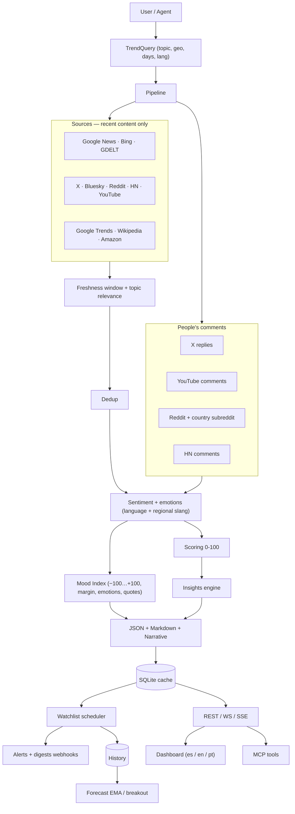

# TrendScope

<p align="center">
  <strong>How do people feel about any topic, in any country? Measured from what they actually say.</strong><br>
  Mood Index · Emotions · Recent news & comments · Watchlist alerts · Forecasting · Live dashboard
</p>

<p align="center">
  <a href="https://github.com/mamboyepez17/trendscope/actions"></a>
  <a href="https://www.python.org/downloads/"></a>
  <a href="LICENSE"></a>
  
  
</p>

---

TrendScope measures **public mood** on any topic to support decisions. It reads what people write — **replies on X, YouTube comments, Reddit and Hacker News threads, Bluesky posts** — classifies every opinion as **joy, anger, sadness, fear or neutral**, and aggregates them into a **Mood Index from −100 to +100** with a margin of error. News headlines are measured separately as *media tone*, so the press never gets mistaken for the public.

It also pulls **recent** signals from Google News, Bing News, GDELT, Google Trends, YouTube, Wikipedia and Amazon (products with star ratings and review counts), scores them 0–100, and produces insights, correlations and recommendations — **locally**, without a paid AI API for the core path.

It works **in any country and language**: per-language lexicons (Spanish, English, Portuguese, French, German, Italian), regional slang packs that only switch on in their own country, your own custom lexicon, country-specific news editions, and a dashboard in Spanish, English and Portuguese.

**Why it exists:** expensive social-listening suites lock you into their data and pricing. TrendScope is free-source-first, agent-friendly (REST + WebSocket + MCP), and meant to run on your machine or a single VPS.

## Table of contents

- [Quick start](#quick-start)
- [Usage](#usage)
- [The Mood Index](#the-mood-index-how-people-feel)
- [Any country, any language](#any-country-any-language)
- [Where people's comments come from](#where-peoples-comments-come-from)
- [Recent content only](#recent-content-only)
- [REST API](#rest-api-for-http-agents)
- [AI providers & model choice](#ai-providers--model-choice)
- [Watchlist, alerts & digests](#watchlist--alerts--digests)
- [Multi-tenant API keys](#multi-tenant-api-keys)
- [Security defaults](#api-protection--security-defaults)
- [Data sources](#data-sources)
- [Architecture](#architecture)
- [Configuration](#configuration)
- [Troubleshooting](#troubleshooting)
- [Tests](#tests)
- [Roadmap](#roadmap)

## Quick start

Requires **Python 3.11 or 3.12**.

```bash
git clone https://github.com/mamboyepez17/trendscope.git
cd trendscope

# Recommended: uv (https://docs.astral.sh/uv/)
uv venv --python 3.11 .venv
uv pip install -e ".[dev]"

# Or with plain venv + pip
python -m venv .venv
# Windows:  .venv\Scripts\activate
# macOS/Linux: source .venv/bin/activate
pip install -e ".[dev]"

# Optional extras
pip install -e ".[x]"        # latest xactions-py for X/Twitter
pip install -e ".[reddit]"   # reddit-actions for Reddit comments
scrapling install            # one-time browser download, used when Amazon shows a captcha

cp .env.example .env   # Windows: copy .env.example .env
```

Start the API and open the dashboard:

```bash
# macOS / Linux
.venv/bin/trendscope-api

# Windows
.venv\Scripts\trendscope-api.exe

# Or from source (any OS)
.venv/bin/python -m trendscope.server_api
# Windows: .venv\Scripts\python.exe -m trendscope.server_api
```

Then open **http://localhost:8000/dashboard**.

Windows shortcuts included: `run_tests.bat`, `start_api.bat`, `start_cli.bat`.

> A copy of [xactions-py](https://github.com/mamboyepez17/xactions-py) (X/Twitter toolkit, v1.8.0) is vendored under `trendscope/xactions/`. If the `x` extra is installed, TrendScope uses the package instead, so you always get the latest version.

## Try it in 5 minutes

```bash
# 1. Diagnose data sources (network)
trendscope --doctor
# or:  .venv/bin/python -m trendscope.ops --doctor

# 2. Offline pipeline smoke (no network required)
trendscope --smoke

# 3. Start the API
trendscope-api

# 4. Open in the browser
#    http://localhost:8000/dashboard
#    http://localhost:8000/demo     ← sample payload, no scraping
#    http://localhost:8000/smoke    ← doctor + offline smoke JSON
#    http://localhost:8000/docs
```

Optional live smoke (lightweight public sources only: HN, GDELT, Google RSS):

```bash
trendscope --smoke --live
```

If X cookies are set in `.env`, a full `GET /trends?topic=...` also reads real replies on X.

## Usage

### CLI

```bash
# macOS / Linux
.venv/bin/trendscope
.venv/bin/python -m trendscope

# Windows
.venv\Scripts\trendscope.exe
.venv\Scripts\python.exe -m trendscope
```

### Web dashboard

Start the API (see Quick start), then open **http://localhost:8000/dashboard**.

- **Languages:** Spanish, English and Portuguese. The UI language and country start from your browser settings, and the country field suggests every country by name.
- **Mood tab:** mood hero with the −100…+100 index and its margin, KPIs (opinions, distinct people, intensity, polarization, media tone, freshness), emotion bars, "what are they talking about?", representative quotes, mood by source and an AI summary.
- **Trends tab:** recent items with their age ("3 h ago") and emotion.
- **Compare tab:** two topics side by side.
- **Monitoring tab:** watchlist plus mood history.
- **Themes:** light and dark follow the OS, with a manual toggle. Emotion colors are validated for color-blind safety.
- **Tech:** local Chart.js, strict CSP, WebSocket.

If `API_KEY_REQUIRED=true`, open `/dashboard?api_key=YOUR_KEY` (or store the key in `sessionStorage` as `ts_api_key`).

### Doctor (diagnose sources)

```bash
.venv/bin/python -c "from trendscope.core.doctor import run_doctor; from rich.console import Console; Console().print(run_doctor())"
# Windows: .venv\Scripts\python.exe -c "..."
```

Or `GET /doctor`. Real probes on each source with actionable fix instructions.

### Docker

```bash
cp .env.example .env
docker compose up -d
docker compose logs -f
```

The API is available at **http://localhost:8000** and the dashboard at **http://localhost:8000/dashboard**. The `data/` folder is mounted as a volume, so analysis results and the SQLite history persist across restarts.

```bash
docker compose exec trendscope pytest trendscope/tests/ -v
```

### MCP Server (for MCP-compatible agents)

```bash
.venv/bin/trendscope-mcp
# Windows: .venv\Scripts\trendscope-mcp.exe
# Or:      .venv/bin/python -m trendscope.server_mcp
```

Available tools (MCP SDK 2.x):

- `analyze_trends` — Multi-source analysis with sentiment and mood
- `get_categories` — Predefined categories
- `get_latest_report` — Latest Markdown report
- `narrate_trends` — AI narrative (executive/creative/technical/alert)
- `compare_topics` — Side-by-side comparison
- `doctor` — Source health probes
- `watchlist_add` · `watchlist_list` · `watchlist_run`
- `history_get` — Historical snapshots (no full payload)

### SKILL.md (for agent discovery)

TrendScope includes a `SKILL.md` file that AI agents (Claude Code, OpenClaw, Hermes, Cursor) can discover automatically. It describes all available commands, endpoints, and configuration options.

## The Mood Index (how people feel)

The main meter comes from **what people say** (comments, replies and social posts), not from headlines. Every opinion gets an emotion distribution over **joy, anger, sadness, fear and neutral**:

- **Inputs:** a model when available (pysentimiento or Claude), blended with a per-language lexicon, regional slang and emojis.
- **Language handling:** negations ("not happy", "no estoy feliz") and intensifiers ("very", "!!!", ALL CAPS) are handled.

Opinions are then aggregated like this:

| Step | Rule |
|---|---|
| Weight by type | comment 1.0 · social post 0.7 · news 0 (reported separately as *media tone*) |
| Engagement | `1 + min(3, log10(1 + likes))` — a viral comment weighs up to 4×, never 1000× |
| One person, one vote | each author's weight is divided by their number of messages |
| Net index | `100 · Σ w·polarity / Σ w`, from −100 to +100, with a ±95% margin (`n_eff = (Σw)²/Σw²`) |
| Mood | **Happy / Angry / Sad / Worried / Divided / Neutral**; the sign of the index always wins |

The index also reports:

- the share of each emotion, polarization, intensity and a confidence level (`high` / `medium` / `low`)
- representative quotes per emotion
- the words that drive each emotion
- a one-line headline, e.g. *"People feel mostly worried about «health reform» (26% fear). Net index −29 (±34) from 21 opinions across 5 sources."*

Where to find it:

- `meta.mood_index` in `/trends`
- `mood_index` in `/conversation`
- `meta.media_tone` in `/trends` (press headlines)

The overall `sentiment_summary.overall` label is derived from the weighted net index, not from the most frequent label.

## Any country, any language

TrendScope works for any country (`?geo=XX`, ISO 3166-1 alpha-2) and adapts automatically:

| What | How |
|---|---|
| Text language | Detected per text: **es, en, pt, fr, de, it**, each with its own lexicon |
| Local slang | Regional packs that only switch on in their own country: **CO, MX, AR, UY, CL, PE, VE, ES, BR, US** (e.g. *"qué chimba"* is joy in Colombia and neutral in Mexico) |
| Your own slang | `CUSTOM_LEXICON_PATH=my_lexicon.json`: words or multi-word phrases by language or country ([example](docs/lexicon.example.json)) |
| News | Google News edition of the country (`hl`/`gl`/`ceid`) and YouTube in its language |
| Reddit | Also searches the country's subreddit (r/Colombia, r/mexico, r/brasil…) |
| Index labels & AI summary | `?lang=es\|en\|pt` (defaults to the country's language; other languages fall back to English) |
| Dashboard | Español / English / Português; language and country default to the browser's |

Custom lexicon format (every key is optional):

```json
{
  "*":  { "joy": ["awesome sauce"], "anger": ["rip-off"] },
  "es": { "sadness": ["qué tusa"] },
  "CO": { "fear": ["culillo"], "joy": ["qué nota"] }
}
```

Categories: `joy`, `anger`, `sadness`, `fear`, `neg` (generic negative), `negations`, `intensifiers`.

- **Languages without a lexicon** (Japanese, Arabic…): emojis still count, and the `claude` engine is multilingual, so use `?sentiment_engine=claude`.
- **Contributing slang for a new country:** add an entry to `trendscope/sentiment/lexicons/regional.py`. Only include words that are unambiguous in that country.

## Where people's comments come from

| Source | What it brings | Requirement |
|---|---|---|
| **X** | Real replies to the topic's most-discussed recent tweets (`get_tweet_replies_sync` from [xactions-py](https://github.com/mamboyepez17/xactions-py)) | X cookies in `.env`; optionally `pip install -e ".[x]"` |
| **YouTube** | Comments on the most-viewed recent videos that name the topic | Nothing (no API key) |
| **Reddit** | Comments from the topic's threads (global + the country's subreddit) | Optionally `pip install -e ".[reddit]"` ([reddit-actions](https://github.com/mamboyepez17/reddit-actions)) + a session cookie if Reddit returns 403 |
| **Hacker News** | Comments mentioning the topic | Nothing |

`/trends` collects comments in parallel with the other sources. Comments feed the Mood Index but never enter the trend ranking. Set `PIPELINE_COLLECT_COMMENTS=false` to skip them.

## Recent content only

Every source asks for content from the last `MAX_AGE_DAYS` days (default 7; `?days=1..30` in the API):

| Source | Filter |
|---|---|
| Google News | `when:Nd` |
| Bing News | interval filter |
| GDELT | `timespan` + sort by date |
| X | `since:` |
| Bluesky | `since` |
| Reddit | `t=` |
| Hacker News | `created_at_i` |
| YouTube | upload-date filter |

The pipeline then normalizes every date (RSS, ISO, GDELT formats) and **drops anything older** than the window. `meta.freshness` reports how many items were dropped and the median age of what was kept.

**Relevance:**

- Free topics are searched as an **exact phrase**, without extra "country / year / trends" keywords.
- News and video headlines must name **the whole topic** ("tax reform" no longer matches "health reform").
- Posts and comments only need one topic word, because people write casually.

## REST API (for HTTP agents)

```bash
.venv/bin/trendscope-api          # Windows: .venv\Scripts\trendscope-api.exe
```

Default bind: `127.0.0.1:8000`. Interactive docs: **http://localhost:8000/docs**

```text
GET    /trends?topic=health+reform&geo=CO&days=7&lang=en
GET    /trends?topic=AI&async=true     — 202 + job_id
GET    /trends?category=technology&sentiment_engine=claude
GET    /conversation?topic=...&geo=MX&days=3&lang=es  — posts + comments + mood_index
GET    /narrate?topic=...&style=executive&lang=pt
GET    /demo                          — offline sample payload
GET    /smoke                         — doctor + offline smoke
GET    /discover?geo=CO|US|GLOBAL     — trending topics
GET    /export/csv|json|xlsx?topic=...
GET    /report?topic=crypto
GET    /categories · /health · /doctor
GET    /metrics · /metrics.json        — Prometheus-style text / JSON
GET    /cache/stats · DELETE /cache    — DELETE requires the admin scope
GET    /dashboard · /static/chart.umd.min.js
GET    /compare?topic1=crypto&topic2=AI
GET    /jobs/{id}                      — poll async job
GET    /jobs/{id}/events               — SSE status stream
GET    /forecast?topic=AI&days=30      — EMA, velocity, breakout
GET    /history?topic=...&days=7
GET    /watchlist · GET /watchlist/stats
POST   /watchlist?topic=...&geo=...&alert_webhook=...&alert_min_score=80
POST   /watchlist/{id}/run[?background=true]
PUT    /watchlist/{id} · DELETE /watchlist/{id}
POST   /admin/prune-history            — requires the admin scope
WS     /ws[?api_key=...]               — send {"topic", "geo", "days", "lang", ...}
```

Common query parameters:

| Parameter | Meaning |
|---|---|
| `geo` | Country code (ISO 3166-1 alpha-2) |
| `days` | Freshness window, 1–30 (default `MAX_AGE_DAYS`) |
| `lang` | Language of mood labels, headlines and AI narrative: `es`, `en`, `pt` |
| `sentiment_engine` | `local` (free), `claude` (multilingual, premium) or `llm` (any AI provider — see below) |
| `llm_provider` / `llm_model` | AI provider and model for `sentiment_engine=llm` and `/narrate` (default: `LLM_PROVIDER` and its `*_MODEL` in `.env`) |

Headers on responses: `X-RateLimit-Limit`, `X-RateLimit-Remaining`, `Retry-After` on 429.

## AI-Powered Narrative Generation

Generate human-readable summaries, creative copy, technical analysis, or risk alerts from any query. The narrative receives the Mood Index and representative quotes, and answers in the requested language (`lang`, or the country's language by default).

```bash
curl "http://localhost:8000/narrate?topic=crypto&geo=US&style=executive"

# Styles: executive, creative, technical, alert
```

Pick any provider and model per request:

```bash
curl "http://localhost:8000/narrate?topic=crypto&llm_provider=claude&llm_model=claude-opus-5-5"
curl "http://localhost:8000/narrate?topic=crypto&llm_provider=deepseek"   # model from DEEPSEEK_MODEL
```

If no provider is configured, `/narrate` returns a structured statistical summary instead.

## AI providers & model choice

One AI layer (`trendscope/llm`) powers both the narrative and the `llm` sentiment engine. Put the key of the provider you want in `.env`, choose a default with `LLM_PROVIDER`, and optionally override provider and model on each request with `llm_provider` / `llm_model`. The dashboard has an **AI** and **Model** picker next to the engine selector (the model box autocompletes from the provider's live model list).

| `llm_provider` | Service | Key | Default model |
|---|---|---|---|
| `openai` (alias `chatgpt`) | OpenAI / ChatGPT | `OPENAI_API_KEY` | `OPENAI_MODEL` |
| `claude` (alias `anthropic`) | Anthropic Claude | `ANTHROPIC_API_KEY` | `CLAUDE_MODEL` (`claude-opus-5-5`) |
| `deepseek` | DeepSeek | `DEEPSEEK_API_KEY` | `DEEPSEEK_MODEL` |
| `opencode` (alias `zen`) | OpenCode Zen | `OPENCODE_API_KEY` | `OPENCODE_MODEL` |
| `openrouter` | OpenRouter (hundreds of models, some free) | `OPENROUTER_API_KEY` | `OPENROUTER_MODEL` |
| `gemini` (alias `google`) | Google Gemini | `GEMINI_API_KEY` | `GEMINI_MODEL` |
| `groq` | Groq | `GROQ_API_KEY` | `GROQ_MODEL` |
| `mistral` | Mistral | `MISTRAL_API_KEY` | `MISTRAL_MODEL` |
| `xai` (alias `grok`) | xAI Grok | `XAI_API_KEY` | `XAI_MODEL` |
| `ollama` (alias `local`) | Local models, no key | — (`OLLAMA_HOST`) | `OLLAMA_MODEL` |
| `custom` | Any OpenAI-compatible API (LM Studio, vLLM, Together, Azure…) | `LLM_API_KEY` + `LLM_BASE_URL` | `LLM_MODEL` |

```bash
GET /llm/providers                 # which providers exist, which are configured (keys are never returned)
GET /llm/models?provider=openai    # live model list from that provider
GET /trends?topic=Bitcoin&sentiment_engine=llm&llm_provider=groq&llm_model=<model>
GET /narrate?topic=Bitcoin&llm_provider=opencode&llm_model=<model>
```

Notes:

- If a provider has no default model in `.env`, you must pass `llm_model` — the error message tells you which variable to set and where to list models.
- Model names change often; use `/llm/models` (or the dashboard autocomplete) instead of hard-coding them.
- The `llm` sentiment engine classifies in batches and falls back to the local engine for any batch that fails (missing key, rate limit, bad JSON), so an analysis never comes back silently "neutral".
- Unsupported parameters are handled automatically (e.g. models that reject `temperature` or need `max_completion_tokens`).

## Data Export

| Format | Endpoint | Use case |
|---|---|---|
| JSON | `/export/json?topic=...` | Structured data for agents / BI |
| CSV | `/export/csv?topic=...` | Spreadsheets, data science |
| Excel | `/export/xlsx?topic=...` | Reports with two sheets: Trends + Metadata |

## Watchlist + Alerts + Digests

```bash
# Add a monitored topic with a score alert and daily digest
POST /watchlist?topic=crypto&geo=US&interval_minutes=60\
  &alert_webhook=https://hooks.example.com/ts\
  &alert_min_score=80\
  &alert_sentiment_flip=true\
  &digest_webhook=https://hooks.example.com/ts-daily\
  &digest_interval_hours=24

GET  /watchlist
POST /watchlist/{id}/run[?background=true]
GET  /history?topic=crypto&days=7
GET  /forecast?topic=crypto
GET  /watchlist/stats
```

- **Alerts** fire when `top_score >= alert_min_score`, volume crosses a threshold, or sentiment flips. Webhooks are POST JSON with SSRF protection (localhost/private/metadata IPs blocked).
- **Digests** send a compact summary (latest scores, min/max/avg, forecast) on an interval.
- **Forecast** returns EMA, velocity, and a breakout flag from history.
- Enable/disable scheduling with `WATCHLIST_ENABLED=true|false`.

## Multi-tenant API keys

Static keys can carry an org and scopes:

```env
API_KEY_REQUIRED=true
# legacy: key1,key2
# scoped: key|org|scope+scope
API_KEYS=readkey|acme|trends:read,fullkey|acme|trends:read+watchlist:write+admin
ORG_RATE_LIMIT=120
```

Scopes: `trends:read`, `watchlist:read`, `watchlist:write`, `jobs:read`, `admin`.

- Watchlist mutations require `watchlist:write`.
- `DELETE /cache` and `/admin/*` require `admin`.
- Watchlist, history and jobs are isolated per `org_id`.
- Rate limits apply per IP **and** per org.
- WebSocket accepts `?api_key=` (browsers cannot set custom headers).

## API Protection & security defaults

- Default bind: **`127.0.0.1`** (set `API_HOST=0.0.0.0` only when you need it; enable API keys).
- Optional API keys (constant-time compare) with scopes.
- Rate limiting (in-memory, per-IP + per-org) with purge of stale buckets.
- Security headers (`X-Content-Type-Options`, `X-Frame-Options`, CSP on dashboard).
- Path-safe export filenames; report lookups reject glob injection.
- Multi-stage Docker image (no compilers/dev tools); compose with `read_only`, `cap_drop: ALL`, healthcheck.

```env
API_HOST=127.0.0.1
API_RATE_LIMIT=60
API_RATE_WINDOW=60
ORG_RATE_LIMIT=120
API_KEY_REQUIRED=false
API_KEYS=
TRUST_PROXY_HEADERS=false
SOURCE_HEALTH_SKIP=true
ALERTS_ENABLED=true
```

## Source health

Each source tracks success/failure and latency. Scores appear in `payload.meta.source_health`. Sources scoring below 0.2 are skipped automatically (`SOURCE_HEALTH_SKIP=true`) to save time and quota.

## Async jobs

```bash
curl "http://localhost:8000/trends?topic=AI&async=true"
# → {"job_id":"...","status":"pending","poll":"/jobs/..."}

curl "http://localhost:8000/jobs/{job_id}"
curl -N "http://localhost:8000/jobs/{job_id}/events"   # SSE
```

## AI-Powered Analysis

TrendScope doesn't just collect data, it **analyzes it**:

1. **Executive summary**: natural-language findings
2. **Actionable insights**: opportunities, alerts, info with priorities
3. **Correlations**: consensus / divergence / score gaps across sources
4. **Emerging vs established**: signals seen in one source vs several distinct sources
5. **Recommendations**: concrete next steps

All local logic; no API keys required for this path.

## Data Sources

| Source | Method | Cost | Requires Auth |
|---|---|---|---|
| X (Twitter) | xactions-py GraphQL: recent search (`since:`) + real replies | Free | Yes (cookies) |
| YouTube | Internal API: recent-upload search + video comments | Free | No |
| Reddit | reddit-actions / public JSON + RSS, global + country subreddit | Free | Optional |
| Hacker News | Algolia search (stories + comments, date-filtered) | Free | No |
| Bluesky | Public AppView search (`since`) | Free | No |
| Google News | RSS search, exact phrase, country edition, `when:Nd` | Free | No |
| Bing News | RSS search, exact phrase, interval filter | Free | No |
| GDELT | DOC API 2.0 (global news, `timespan`) | Free | No |
| Google Trends | RSS primary + pytrends + relevance scoring | Free | No |
| Wikipedia (es) | Search API (context) | Free | No |
| TweetClaw/OpenClaw | Optional local JSON export | Free | No (bring your own file) |
| Amazon | Topic search in the country's store (amazon.com.mx, amazon.com.br, amazon.es…; others use amazon.com) with star ratings and review counts; Best Sellers in category mode. Scrapling HTTP fetcher first, stealth browser if a captcha appears | Free | No |

## Sentiment Analysis

| Engine | Technology | Cost |
|---|---|---|
| `local` | pysentimiento models for Spanish and English; lexicon + regional slang + emojis for Portuguese, French, German and Italian | Free |
| `local` (fallback) | Lexicon engine for every language (auto-activates if torch is unavailable) | Free |
| `claude` | Claude (Haiku by default, `CLAUDE_SENTIMENT_MODEL`) — sentiment + emotions, any language; falls back to `local` per batch on any error | Low cost |

Language is detected per text, so no configuration is needed. If pysentimiento or torch is unavailable (e.g. Windows WDAC policies), TrendScope automatically uses the lexicon engine.

## Predefined Categories

- tecnologia, economia, salud, moda, deportes, politica, emprendimiento, educacion, inmobiliario, crypto

Also accepts **free topics**: any text you want to analyze.

## Output

Each analysis generates two files in `data/`:

- `trends_DATE_TOPIC.json`: structured JSON for AI agents (includes `mood_index`, `insights` and `agent_prompt`)
- `report_DATE_TOPIC.md`: human-readable Markdown report with an analysis section

Plus exported files via `/export/*`:

- `export_TOPIC_DATE.json`
- `export_TOPIC_DATE.csv`
- `export_TOPIC_DATE.xlsx`

## Architecture


```mermaid
flowchart TD
  U[User / Agent] --> Q["TrendQuery (topic, geo, days, lang)"]
  Q --> P[Pipeline]
  subgraph sources [Sources — recent content only]
    N[Google News · Bing · GDELT]
    S[X · Bluesky · Reddit · HN · YouTube]
    O[Google Trends · Wikipedia · Amazon]
  end
  subgraph comments [People's comments]
    XR[X replies]
    YC[YouTube comments]
    RC[Reddit + country subreddit]
    HC[HN comments]
  end
  P --> sources
  P --> comments
  sources --> F[Freshness window + topic relevance]
  F --> D[Dedup]
  D --> SE["Sentiment + emotions (language + regional slang)"]
  comments --> SE
  SE --> SC[Scoring 0-100]
  SE --> MI["Mood Index (−100…+100, margin, emotions, quotes)"]
  SC --> I[Insights engine]
  MI --> OUT[JSON + Markdown + Narrative]
  I --> OUT
  OUT --> CACHE[(SQLite cache)]
  CACHE --> API[REST / WS / SSE]
  CACHE --> W[Watchlist scheduler]
  W --> AL[Alerts + digests webhooks]
  W --> HIST[(History)]
  HIST --> FC[Forecast EMA / breakout]
  API --> DASH["Dashboard (es / en / pt)"]
  API --> MCP[MCP tools]
```

High-level flow:

1. Scrape recent content and people's comments in parallel.
2. Apply the freshness window and topic relevance, then dedup.
3. Run sentiment and emotions, then scoring and the Mood Index.
4. Generate insights and cache the result.
5. Serve it through REST, WS, MCP and the dashboard.

Source health scores live in memory and can skip unhealthy sources automatically.

## Stack

| Layer | Choice |
|---|---|
| Runtime | Python 3.11–3.12 |
| API | FastAPI + uvicorn |
| Scraping | requests · Scrapling 0.4 (HTTP fetcher + stealth browser) · xactions-py (vendored or package) · reddit-actions (optional) |
| Sentiment | pysentimiento (ES/EN) · per-language lexicons + regional slang + emojis · Claude optional |
| Narrative | DeepSeek · OpenRouter · Claude · Ollama · statistical fallback |
| Persistence | SQLite (WAL): cache, watchlist, history, jobs |
| Scheduling | APScheduler |
| Agents | REST · WebSocket · SSE · MCP SDK 2.x |
| UI | Single-page dashboard (es/en/pt) + local Chart.js (CSP `script-src 'self'`) |
| Ops | loguru · lightweight `/metrics` · Docker multi-stage |

## Configuration

Copy `.env.example` to `.env` and fill in what you need:

```env
# Country and freshness
GEO_TARGET=CO               # default country (ISO 3166-1 alpha-2); any country works
MAX_AGE_DAYS=7              # only content from the last N days (1–30)
TOP_N=25

# People's comments for the Mood Index
PIPELINE_COLLECT_COMMENTS=true
CUSTOM_LEXICON_PATH=        # your own slang/brand lexicon (see docs/lexicon.example.json)


# X/Twitter (DevTools > Application > Cookies on x.com)
TWITTER_AUTH_TOKEN=your_auth_token
TWITTER_CT0=your_ct0
# TWITTER_COOKIES=auth_token=...; ct0=...

# Reddit (optional)
REDDIT_CLIENT_ID=
REDDIT_CLIENT_SECRET=
REDDIT_USER_AGENT=TrendScope/1.5.0
# With the [reddit] extra, if Reddit returns 403:
# REDDIT_SESSION_COOKIE=
# REDDIT_COOKIE_HEADER=

# TweetClaw/OpenClaw optional JSON export path
TWEETCLAW_RESULTS_FILE=

# Sentiment engine: local | claude
SENTIMENT_ENGINE=local
ANTHROPIC_API_KEY=
CLAUDE_SENTIMENT_MODEL=claude-haiku-4-5

# Narrative
NARRATOR_PROVIDER=openrouter   # openrouter | deepseek | claude | ollama
NARRATIVE_ENABLED=true
OPENROUTER_API_KEY=
OPENROUTER_MODEL=deepseek/deepseek-chat-v3-0324:free
DEEPSEEK_API_KEY=
OLLAMA_ENABLED=false
OLLAMA_HOST=http://localhost:11434
OLLAMA_MODEL=qwen3.5:9b

# API
API_HOST=127.0.0.1
API_PORT=8000
API_RATE_LIMIT=60
API_RATE_WINDOW=60
ORG_RATE_LIMIT=120
API_KEY_REQUIRED=false
API_KEYS=
TRUST_PROXY_HEADERS=false
SOURCE_HEALTH_SKIP=true
ALERTS_ENABLED=true

# Cache
CACHE_TTL_SECONDS=300
```

**Note:** all credentials are optional. Without them, TrendScope still reads YouTube comments, Hacker News, Reddit, Bluesky, Google News, Bing, GDELT, Google Trends and more. Only X requires cookies.

## Troubleshooting

### Run the doctor first

```bash
.venv/bin/python -c "from trendscope.core.doctor import run_doctor; from rich.console import Console; Console().print(run_doctor())"
# Windows: .venv\Scripts\python.exe -c "..."
```

It tells you exactly what's working, what's not, and how to fix it.

### "Sin datos" / "No data" in the Mood Index

No opinions were found in the time window. Try a longer period (`days=30`), a broader topic, or add X cookies. `meta.comments.sources` shows what each comment source returned.

### News about unrelated topics

Free topics are searched as an exact phrase, and news headlines must name the whole topic. If a topic has several common names, analyze each one, or compare them with `/compare`.

### pysentimiento / torch import error on Windows

If you see `OSError: [WinError 4551]`, Windows WDAC is blocking PyTorch DLLs. TrendScope automatically falls back to the lexicon engine; no action needed.

### Reddit returns 403

Reddit blocked the public JSON endpoint. Install the optional `reddit` extra (`pip install -e ".[reddit]"`, uses [reddit-actions](https://github.com/mamboyepez17/reddit-actions)) and set `REDDIT_SESSION_COOKIE` or `REDDIT_COOKIE_HEADER` so comments keep flowing. Without it, TrendScope falls back to RSS via `old.reddit.com` and other comment sources.

### X returns 401 or 403

Your cookies may have expired. Get fresh cookies from x.com → DevTools (F12) → Application → Cookies → x.com and copy `auth_token` and `ct0` into your `.env`. Installing the `x` extra keeps xactions-py up to date with X's latest request signing.

### No Amazon results

- `Amazon: falta Scrapling con fetchers` → `pip install "scrapling[fetchers]"`.
- `falta el navegador de Scrapling` → run `scrapling install` once (the browser is only used when Amazon shows a captcha).
- Amazon results must name the whole topic, so topics that are not products (e.g. a political reform) return no Amazon items. That is expected.

### No YouTube comments

Some videos have comments disabled. YouTube's internal API can also change without notice; TrendScope then logs a warning and keeps working with the other sources.

### OpenRouter returns 401

Your API key may be invalid or missing. Get a free key at [openrouter.ai/keys](https://openrouter.ai/keys) and add it to `.env` as `OPENROUTER_API_KEY`.

## Tests

```bash
.venv/bin/python -m pytest trendscope/tests/ -v

# Optional long-running performance budgets:
.venv/bin/python -m pytest trendscope/tests/ -v -m slow
```

Windows: use `.venv\Scripts\python.exe` instead of `.venv/bin/python`.

**375+ tests** covering:

- **Mood & sentiment:** Mood Index math, emotions in six languages, regional slang, custom lexicons.
- **Data quality:** freshness window, news relevance, X replies, YouTube comments.
- **API:** API security and scopes, middleware, pipeline, OpenAPI, MCP tools.
- **Storage & jobs:** SQLite concurrency, watchlist, alerts, digests, jobs + SSE, forecast, org isolation.
- **Ops:** Docker hardening, performance budgets, and more.

## Development notes

- Use `create_app()` from `trendscope.api.factory` in tests (injectable store/scheduler, no DB side effects at import).
- Prefer `trendscope.settings.Settings` over ad-hoc env reads.
- Tests never scrape the network: `conftest.py` disables comment collection in `/trends`.
- Repository interface: `trendscope/watchlist/repository.py` (`WatchlistRepository` / `SqliteWatchlistRepository`), ready for a Postgres adapter later.

### Project layout (simplified)

```text
trendscope/
  scrapers/          # one file per source (run(query) -> list[dict])
    comments.py      # people's comments: X replies, YouTube, Reddit, HN
  analyzer/          # dedup, scoring, insights, mood_index, forecast
  sentiment/         # local + claude engines, emotions, language detection
    lexicons/        # base.py (6 languages) + regional.py (slang by country)
  narrator/          # DeepSeek / OpenRouter / Claude / Ollama
  core/              # pipeline, dates, locale, text, cache, metrics, source health
  watchlist/         # store, scheduler, alerts, digest, repository
  jobs/              # async job queue (SQLite-backed)
  api/               # factory, routes, middleware, auth keys
  models/            # typed payload helpers
  xactions/          # vendored X/Twitter toolkit (xactions-py v1.8.0)
  dashboard.html     # single-page UI (es / en / pt)
  static/            # dashboard.js + local Chart.js
docs/
  lexicon.example.json
```

## Roadmap

Done:

- [x] Installable package + pyproject
- [x] Typed settings (pydantic-settings)
- [x] Persistent SQLite cache (WAL)
- [x] Multi-provider narratives (DeepSeek, OpenRouter, Claude, Ollama)
- [x] CSV / JSON / Excel export
- [x] Rate limiting + API keys + scopes + org isolation
- [x] Watchlist + alerts + digests + forecast
- [x] Dashboard (WS, local Chart.js, CSP)
- [x] Async jobs + SSE
- [x] Source health runtime
- [x] Docker multi-stage + CI (pytest + ruff)
- [x] Mood Index from people's comments (emotions, weighting, margin of error)
- [x] Real X replies and YouTube comments
- [x] Recent-content window across all sources + exact-phrase news relevance
- [x] Any country / any language (6 lexicons, regional slang, custom lexicons, es/en/pt UI)

Next:

- [ ] Mood-shift alerts on the watchlist ("net index dropped 20 points in 24 h")
- [ ] Narrative clustering (group the conversation into 3–6 storylines, each with its mood)
- [ ] Bot / coordinated-amplification detection
- [ ] Hand-labeled evaluation set to measure each engine's accuracy per language
- [ ] App store reviews (Google Play / App Store) for brands and products
- [ ] TikTok via a dedicated `tiktok-actions` toolkit (the public Creative Center API now rejects unsigned requests, so TikTok was removed for now)
- [ ] Postgres adapter / Redis queue (optional scale-out)

## Related

- [xactions-py](https://github.com/mamboyepez17/xactions-py): X/Twitter toolkit (vendored locally, or install with the `x` extra)
- [reddit-actions](https://github.com/mamboyepez17/reddit-actions): Reddit posts & comments toolkit (optional `reddit` extra)

## License

[MIT](LICENSE): built for people who want to know how the public feels without the enterprise invoice.
